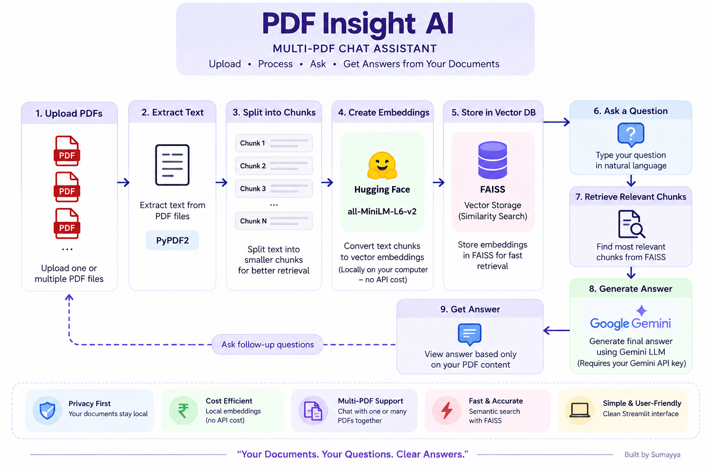

# PDF Insight AI 📚🤖

A Streamlit-based AI application that lets you upload multiple PDF documents and ask questions about their content using Retrieval-Augmented Generation (RAG).

PDF Insight AI extracts text from uploaded PDFs, splits it into meaningful chunks, creates local semantic embeddings using a Hugging Face sentence-transformer model, stores them in FAISS, and retrieves the most relevant content to provide context-aware answers using Google Gemini.

---

## 📝 Description

PDF Insight AI is designed to make it easier to interact with information stored across multiple PDF documents.

Instead of manually searching through lengthy documents, users can upload one or more PDFs, process them, and ask questions in natural language.

The application follows a Retrieval-Augmented Generation (RAG) workflow:

- PDF text is extracted using PyPDF2.
- Extracted text is divided into smaller chunks.
- Local embeddings are generated using `all-MiniLM-L6-v2`.
- FAISS is used for efficient similarity search.
- Relevant document chunks are retrieved for each question.
- Google Gemini generates an answer using the retrieved context.

The application is built with Streamlit and can be run locally or deployed as a web application.

---

## 🎯 Key Features

- 📚 **Multiple PDF Uploads**
  Upload and process multiple PDF documents at the same time.

- 🔎 **Semantic Search**
  Retrieves document sections that are semantically relevant to the user's question.

- 🧠 **Retrieval-Augmented Generation (RAG)**
  Uses retrieved PDF content as context for generating answers.

- 🤖 **Google Gemini Integration**
  Uses Google Gemini for natural-language answer generation.

- 🔐 **Local Embeddings**
  Uses the `sentence-transformers/all-MiniLM-L6-v2` model locally for generating embeddings.

- ⚡ **FAISS Vector Search**
  Uses FAISS for efficient similarity search over document embeddings.

- 💬 **Natural-Language Questions**
  Users can ask questions about their uploaded documents using normal language.

- 🚫 **Context-Grounded Responses**
  The application is instructed not to generate an answer when the requested information is not available in the retrieved document context.

- 🌐 **Streamlit Interface**
  Provides a simple browser-based interface for uploading documents and asking questions.

---

## 🏗️ How It Works



The application follows these steps:

### 1. PDF Upload

Users upload one or more PDF documents through the Streamlit interface.

### 2. Text Extraction

`PyPDF2` extracts the text from each page of the uploaded PDF files.

### 3. Text Chunking

The extracted text is divided into smaller chunks using LangChain's `RecursiveCharacterTextSplitter`.

Current configuration:

- Chunk size: `1500`
- Chunk overlap: `200`

### 4. Local Embeddings

Each text chunk is converted into a numerical vector using:

`sentence-transformers/all-MiniLM-L6-v2`

The embedding model runs locally and does not require a Gemini embedding API call.

### 5. FAISS Vector Store

The generated embeddings are stored in a FAISS vector store.

FAISS enables the application to efficiently search for document chunks that are semantically similar to a user's question.

### 6. Question Processing

When a user asks a question, the question is compared against the stored document embeddings.

### 7. Relevant Context Retrieval

FAISS retrieves the most relevant document chunks for the question.

### 8. Answer Generation

The retrieved context is passed to Google Gemini, which generates the final response based on the available document content.

### 9. Answer Display

The generated answer is displayed directly in the Streamlit application.

---

## 🛠️ Technology Stack

| Technology | Purpose |
|---|---|
| Python | Application development |
| Streamlit | Web application interface |
| PyPDF2 | PDF text extraction |
| LangChain | Text processing and RAG workflow |
| Hugging Face Sentence Transformers | Local text embeddings |
| FAISS | Vector similarity search |
| Google Gemini | Answer generation |
| python-dotenv | Local environment variable management |

---

## 📁 Project Structure

```text
PDF-Insight-AI/
│
├── chatapp.py
├── requirements.txt
├── README.md
├── LICENSE
├── .gitignore
├── .env
│
└── img/
    ├── my_logo.png
    └── architecture.png
```

> `.env`, virtual environments, generated FAISS data, and other local files should not be committed to GitHub.

---

## ⚙️ Requirements

Before running the application, make sure you have:

- Python 3.14.3
- pip
- A Google Gemini API key
- Internet access for Gemini API requests
- Sufficient local resources to load the embedding model

The required Python packages are listed in `requirements.txt`.

---

## 🚀 Installation

### 1. Clone the repository

```bash
git clone https://github.com/Sumayya012/PDF-Insight-AI.git
cd PDF-Insight-AI
```

### 2. Create and activate a virtual environment

**Windows PowerShell:**

```powershell
python -m venv venv
.\venv\Scripts\Activate.ps1
```

### 3. Install dependencies

```bash
pip install -r requirements.txt
```

### 4. Configure the Google Gemini API key

Create a `.env` file in the project root:

```env
GOOGLE_API_KEY=your_google_gemini_api_key
```

Do not commit the `.env` file to GitHub.

### 5. Run the application

```bash
streamlit run chatapp.py
```

The application will open in your browser.

---

## 💡 Usage

### Step 1 — Upload PDFs

Use the sidebar to upload one or more PDF documents.

### Step 2 — Process the PDFs

Click **Submit & Process**.

The application will:

1. Extract text from the PDFs.
2. Split the text into chunks.
3. Generate local embeddings.
4. Create the FAISS vector store.

### Step 3 — Ask Questions

Enter a question related to the uploaded documents.

For example:

```text
What is the main objective of this document?
```

or:

```text
Explain the methodology described in the PDF.
```

### Step 4 — View the Answer

The application retrieves relevant content from the uploaded PDFs and uses Google Gemini to generate the response.

If the requested information is not available in the retrieved context, the application is instructed not to provide an unsupported answer.

---

## 🧪 Testing

The application can be tested using:

**Single PDF**
Upload a small PDF and ask questions whose answers are clearly present in the document.

**Multiple PDFs**
Upload multiple related PDFs and ask questions about information contained in different documents.

**Large PDFs**
Test with longer documents to verify text extraction, chunking, embedding generation, and retrieval.

**Out-of-context Questions**
Ask a question whose answer is not present in the uploaded documents. The application should indicate that the answer is not available in the provided context rather than inventing information.

---

## 🔄 RAG Pipeline

```text
PDF Documents
      ↓
Text Extraction
      ↓
Text Chunking
      ↓
Local Hugging Face Embeddings
      ↓
FAISS Vector Store
      ↓
User Question
      ↓
Similarity Search
      ↓
Relevant Document Chunks
      ↓
Google Gemini
      ↓
Generated Answer
```

---

## 🔐 Privacy & API Usage

The document embeddings are generated locally using the Hugging Face sentence-transformer model.

Google Gemini is used for the final answer-generation step using the retrieved document context.

The Google Gemini API key is stored outside the source code through environment configuration and should never be committed to the repository.

---

## ⚠️ Limitations

- The quality of answers depends on the quality and extractability of the PDF text.
- Scanned PDFs that contain images instead of selectable text may require OCR for reliable extraction.
- The application currently focuses on PDF documents.
- The application depends on the availability of the Google Gemini API.
- Very large documents may require more processing time and memory.
- The application answers based on retrieved document context rather than acting as a general-purpose knowledge base.

---

## 🔮 Future Improvements

Potential future improvements include:

- OCR support for scanned PDFs
- Conversation history
- Source/page references for retrieved answers
- Improved document management
- Streaming responses
- Better error handling
- Support for additional document formats
- More advanced retrieval and ranking techniques
- Persistent vector-store management
- Authentication and user-specific document sessions

---

## 📄 License

Distributed under the MIT License. See the [LICENSE](LICENSE) file for more information.

---

## 👩‍💻 Author

**Sumayya**

Computer Science and Engineering Student

GitHub: [https://github.com/Sumayya012](https://github.com/Sumayya012)
LinkedIn: [https://www.linkedin.com/in/mohammed-sumayya](https://www.linkedin.com/in/mohammed-sumayya/)

---

## ⭐ Support

If you find this project useful, consider giving the repository a ⭐ on GitHub.
